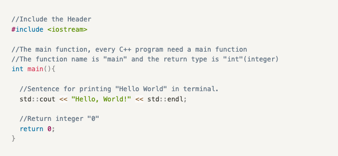

# Lab 00 - Hello World!

## Our Goal in Lab 00

1. Write and run the "Hello World" program in C++ language (in our computer lab).
2. Understand the *command line interface* **(CLI)** "terminal", *integrated development environment* **(IDE)** "visual studio code (**vscode**)" and version control tool "git".
3. Configure the lab environment (Ubuntu) in your laptop.
4. Run your "Hello World" program in your personal lab environment.


## Example of the “Hello, World!” Program in C++


> P.S. **DON’T JUST COPY & PASTE!** It’s a bad programming habit, especially for amateurs. When you do the copy & paste, it’s easy to forget what the code actually does, and then **errors** and **bugs** come.
> 

## Explanation of the code

In C++, it’s a good habit to write comments in our code. They won’t have any effect on programs, but they help others and yourself to understand the meaning of codes. 

Two common ways of writing comments in C++ are:

1. Start with `//` , commenting in a single line.
2. Start with `/*` and end with `*/`, commenting in multiple lines. 

Here, we use comments to explain each line of code:



## Some Illustrative Questions

### 1. What programs do?

We want computer programs to help us do tasks and solve problems. For example, the task of an adder requires accepting **two values as inputs and returning one value as output**. The definition should be `int adder(int a, int b)`.  This may confuse you but it also can helps us understand why the function in a computer always has input parameters and a return value.

### 2. Why we encourage you to type every single character of every command in the lab?

This is because it allows you to become familiar with programming commands and code, so that you can better identify errors in your code in the future. (We went through the same process haha.)

### 3. Why we use Linux(Ubuntu) as our experimental environment? 

Because Linux is currently the environment for all mainstream applications, including machine learning, database, and server development. It is more brief and stable than Windows. Understanding this operating system is very helpful for future development, research, and job searching.

## Task 1: Write and run the "Hello World" program in C++ language.

1. Login to the lab computer with your **student username** and **password**.
2. Click **Ubuntu**, then wait for the operating system (**OS**) to start up.
3. Open "Terminal" through shortcut `ctrl+alt+t`.

    (optional) 3.1. Enter `pwd` in the terminal to **see the current directory**.
    
    (optional) 3.2. Enter `ls` to **see folder(s) and file(s) inside the current directory**.

    (optional) 3.3. Enter `cd Desktop` in the terminal to enter another directory.
    
4. Enter `git clone https://github.com/UFUG2601-CPP-Programming/Lab.git` in the terminal.

    4.1. Enter `code Lab` to open folder Lab in visual studio code(**vscode**).
    
    4.2. Open the *Extensions* (`ctrl+shift+x`) Tab in vscode, search for extension: **C/C++** and install it.
    
5. Use File Explorer (the first icon on the left in **vscode**) to open file `lab00/lab00.cpp`.
6. Write your code in `lab00.cpp` according to comments and slides in the lab(You should pay attention to the **indent** of the code, try using the **tab key** in the upper left corner of the keyboard for **indentation**.). 
7. Open a terminal in VS Code (`ctrl+shift+\`), and enter the following commands in order(Make sure you already **save(ctrl+s)** the file):
    
    ```bash
    cd lab00
    g++ lab00.cpp -o lab00
    ./lab00
    ```
    
    If your code is correct, you will get the output - `Hello, World!`
    
    Then, you can also try:
    
    ```bash
    make
    ```
    
    You should get the same "Hello, World!" result. To learn more about what `make` does, you can check the file `lab00/Makefile` in VS Code.
    

## Task 2: Install the C++ development environment on your own PC/laptop (You may refer to the new screen recording on Canvas instead following steps below, but you also can try if you are interested.)

There are multiple ways to install the development environment on your own PC or laptop, and each of them has its own pros and cons. 

### If you are a Mac user,

Congratulation! You probably already have the C++ toolchains (e.g., GCC) on your MacOS, all you need to do is install other tools like VS Code. If you still want to play with Ubuntu, you can follow the instructions of the **method 1** below. However, the version of software and image you need to download might be different, you need to figure them out by yourself.

### If you are a Windows user,

There are two ways to install the Linux-based development environment on a Windows PC, here we focus on the 

**Method 1: running Ubuntu 20.04 on Virtual Machine (VMWare). [Recommend]**

You can refer to this link for VMWare installation:

[How To Install Ubuntu 20.04 LTS On Windows Using VMware Workstation Player](https://ubuntu.tutorials24x7.com/blog/how-to-install-ubuntu-20-04-lts-on-windows-using-vmware-workstation-player)

We also provide a simple tutorial in this section:

1. You can download VMware Workstation Player here: [Download VMware Workstation Player | VMware](https://www.vmware.com/products/workstation-player/workstation-player-evaluation.html)
2. After downloading the VMware Workstation Player, install it on your computer.
3. Download the image of **Ubuntu 20.04 LTS** here: [Ubuntu 20.04.6 LTS (Focal Fossa)](https://releases.ubuntu.com/focal/) (You need to download the **Desktop Image, ≈ 4 GB**)
4. Open VMware Workstation Player, create a new virtual machine and load it with the image(.iso) you have downloaded.
5. Set up the name of the VM, the username, and the password.
6. Configure the VM, you can just use the default configurations or increase the size of disk and memory on your demand. (20 GB disk + 4 GB memory should be enough)
7. Start your VM with Ubuntu and wait for the installation. Welcome to the world of Linux!

**Method 2: running Ubuntu 20.04 on Windows Subsystem Linux (WSL)**, you can refer to the following links or search it on the Internet: (but most of the time, you probably can only get a terminal interface through this approach)

[What is Windows Subsystem for Linux | Microsoft Learn](https://learn.microsoft.com/en-us/windows/wsl/about)

[Set up a WSL development environment | Microsoft Learn](https://learn.microsoft.com/en-us/windows/wsl/setup/environment)

When using WSL, a good terminal software could be helpful as well, I personally recommend **[MobaXterm](https://mobaxterm.mobatek.net/)**. It has a very good integration with WSL, and you can also use it for **SSH terminal or even Windows terminal**. (What is **SSH**? Well, try to learn it yourself).

VS Code also has an extension for WSL, you can install VS Code on your Windows and use it with WSL.

### If you are a Linux user (😎Cool!)

You know what to do already, we recommend using the **Ubuntu 20.04** distribution to keep the consistency between the environment on your PC/laptop and on lab computers. You can definitely use other distributions, but we will only test the programs on Ubuntu 20.04, you need to take care of yourself.

### After Getting Ubuntu

1. Download and Install VS Code on your Ubuntu (You can download it directly at the startup tab, or download and install it from the internet)
2. **Replace the apt-get source with the Tuna/Aliyun mirror** (If your PC has access to Google and the “outer internet”, you can skip this step)
    
    [ubuntu | 镜像站使用帮助 | 清华大学开源软件镜像站 | Tsinghua Open Source Mirror](https://mirror.tuna.tsinghua.edu.cn/help/ubuntu/)
    
    You need to select the right version of your Ubuntu and replace the file `/etc/apt/sources.list` with the contents in the link. You need to be a `su` to edit the file. A simple method is to use `sudo vim /etc/apt/sources.list`, but you need to learn some basics about `vim` itself.
    
3. **Install basic tools**

```bash
sudo apt-get update
sudo apt-get install build-essential git
```

4. Complete **Task 1** in your own development environment

## You may be confused about

1. What are Linux and Ubuntu? Why are they different from Windows/MacOS?
2. What is a virtual machine?
3. Why does this file end with ".md"? What is the meaning of "MD"?

Try searching the questions above online to get the answers. 

Try asking GPT as well and see if there are any differences in answers!

## Thinking Time

Here are some small thinking exercises we have prepared for you. You can just keep them in your mind and bring them into the lectures.

1. How can we output multiple lines of text?
2. What about numbers?
3. What about both numbers and texts?
4. When we are outputting things, what kinds of data are we actually outputting? Where are we outputting to?
