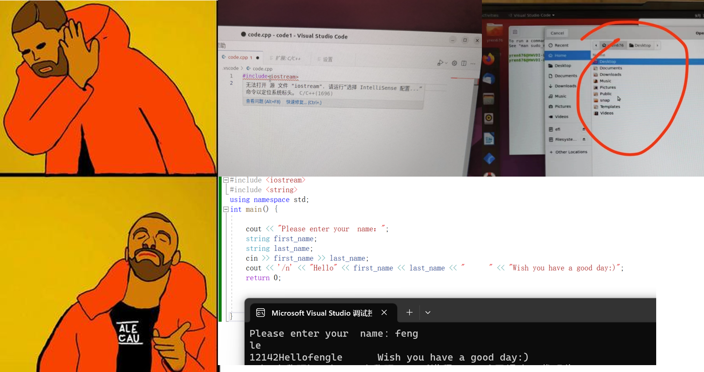

# Lab 01 - Meet The Data Types!

## Our Goal in Lab 01

1. Learn to declare variables of different data types.
2. Learn to output variables of different data types.
3. Learn the limits of different data types.
4. Setup Ubuntu environment for those still unable to run C++ program on your own computers.

## Some illustrative Questions in the Lecture and Lab Session

### 1. The Environment of Running Your C++ Program

**The official answer:** Your program ought to run in **Ubuntu** in a stable environment like your laptop.

**The answer from my personal perspective:** I practice C++ program writing in Windows with **Dev C++ and Codeblock.** I am able to enjoy the experience of writing C++ but I have a hard time getting familiar with **Ubuntu**, **vscode,** and **Compiling C++** with command line interface. **I** **PERSONALLY ENCOURAGE YOU USE ANY APPROACH TO WRITE YOUR C++!**

**Remote Desktop:** The technical team in our university ~~always has a lot of problems~~ is still improving. For example, some of you may notice that your remote environment will be cleaned periodically, and you will need to install all the stuff again. Therefore, Keep it an alternative choice.

### 2. Terrible Question Raising Format



**PLEASE DONT ASK QUESTIONS BY PHOTO.**
**The discussion in Canvas is a good practical way to ask questions.**

And don’t forget to read **how-to-ask-questions** again before you ask!

## Recap the data types in C++

- Integer Numbers
- Floating-point Numbers
- Character & String

If you don’t remember their meanings, review the slides or check the [cppreference](https://en.cppreference.com/w/).
The cppreference is a very useful website that you can refer to.

## Task 0: Clone Our Repository from GitHub

1. Go to the directory that you want in the terminal. (Recap how to open the terminal and go to `Lab` directory.)
2. Enter `git clone https://github.com/UFUG2601-CPP-Programming/Lab.git` in the terminal.

    2.1. Enter `code Lab` to open folder Lab in visual studio code(**vscode**).

    2.2. Open the *Extensions* (`ctrl+shift+x`) Tab in vscode, search for extension: **C/C++** and install it.

    P.S. If you already cloned the `Lab` last time, you can also try to use `git pull` under the `Lab` directory, it will update the repo for you.    

3. Use File Explorer (on the left) to open the directory and finish tasks in different files.

## (DONT COPY & PASTE and PAY ATTENTION TO THE TYPOS IN THE TEMPLATE)
## Task 1: Integer Numbers and Floating-point Numbers

### Task 1.1 Define and Print a Number i.e. `int`

```cpp
#incldue <iostream>

int main(){
	//Define a intger number "n_int"
	int n_int;
	
	//Assign a value to n_int
	n_int = 10;
	
	//Print the integer number
	std::cout << "The value of defined integer is:" << n_int << std::endl;
	
	return 0;

}
```

### Task 1.2 Define and Print a Number, i.e. `short`, `unsinged`, `long long`, `float`, `double`

```cpp
#incldue <iostream>

int main(){
	//Define a number 

	//Assign value

	//Print the number

	return 0;

}
```

### Compile and Run Task 1

```shell
g++ lab01_Task1.cpp -o Task1
./Task1

OR

make Task1
./Task1
```

### (Optional) What will happen if overflow?

### (Optional) How to get the sum of an integer and float?

### (Optional) How to print float reserve two decimals without changing the number of values?

## Task 2: Character and String

### Task 2.1 Define and print a character.

```cpp
#incldue <iostream>

int main(){
	//Define a character "chr"
	char chr;

	//Assign the value to n_int
	chr= 'x';

	//Print the integer number
	std::cout << "The value of defined character is:" << chr<< std::endl;

	return 0;

}
```

### Task 2.2 Define and print a string

```cpp
#incldue <iostream>

int main(){
	//Define a string "str"
	std::string str;

	//Assign the value to n_int
	str = "STRING";

	//Print the integer number
	std::cout << "The value of defined string is:" << str << std::endl;

	return 0;

}
```

### Compile and Run Task 1

```shell
g++ lab01_Task2.cpp -o Task2
./Task2

OR

make Task2
./Task2
```

### (Optional) How to assign value `"` to `chr`?

### (Optional) What is the size of the `char` and why? What is the size of the string `str`?

### (Optional) How to concat two strings?

## Task 3: Learn the limits of data types

We can use the utilities from the header file `<limits>` to check the numeric limits of data types.

```cpp
#incldue <iostream>
#incldue <limits>

int main(){
		
	// Create numeric_limits for type int 
	std::numeric_limits<int> limit;

	// Output the limits using std::cout
	std::cout << "Int Range: " 
			<< limit.min() << "~" << limit.max() << std::endl;
	// Output the size using std::cout
	std::cout << "Size of Int: " << sizeof(int) << std::endl;
	
	/* 
		Try to replace int with other data types (short, unsigned, char, long, double, ...)
		Compare the different limits and size
	*/
	
	// If you read carefully, you are supposed to skip the following line in your code
	int DontCopy = "Do not copy the code!!! Enter it yourself!!!";

	return 0;
}
```

## Thinking Time

1. Where do the limits of each data type come from? What do they represent?
2. What’s the relationship between these numeric limits and sizes? When will these limits change? 
3. What will happen if we assign some value out of the limits to the variables of these data types?
4. What does the ‘<>’ mean in `std::numeric_limits<datatype>`?


## Thinking Time

1. Where do the limits of each data type come from? What do they represent?
2. What’s the relationship between these numeric limits and sizes? When will these limits change? 
3. What will happen if we assign some value out of the limits to the variables of these data types?
4. What does the ‘<>’ mean in `std::numeric_limits<datatype>`?

## Additional Contents

### Prettier Console Output

Plain and colorless outputs make people bored, sometimes we want to emphasize some outputs with colors. Fortunately, we can make use of console colors in our outputs when coding in C++.

You can use `man console_codes`  command to learn about the methods to control console outputs. (use `q` to quit).

In the document, you can find that, to change the settings in console outputs, we need to start with the ASCII character `ESC ('\033')`. After that, we need to build up a so-called control sequence with the next character `'['`. Finally, you can refer to the section **ECMA-48 Set Graphics Rendition** to see what you can achieve using the method. You can use a string to store all these control sequences, then put it before the things you want to output. Here are some examples that you can play with:

```cpp
#include <iostream>
#include <string>

int main(){
	
	std::string default_attr = "\033[0m";       // Set attributes back to default
	std::string red_color    = "\033[31m";	    // Set the font color to red
	std::string blink_font   = "\033[5m";       // Make the text blink!
	std::string bold_font    = "\033[1m";       // Use bold font
	std::string green_bg     = "\033[42m";      // Set the background color to green

	std::cout << red_color << "Hello Red World!" << std::endl;
	std::cout << default_attr << "Hello Default World!" << std::endl;	
	std::cout << green_bg << blink_font << 
		"Hello Green Blinking World!" << std::endl;
	
	// You can try to keep outputting without going back to default attributes
	std::cout << "World, world never change!";

	// Nothing will be outputted explicitly if you only output the control sequence
	std::cout << default_attr << std::endl;
	std::cout << "Bye World!" << std::endl;

	return 0;
}
```

With all these fancy formats, you can create some interesting content in your console now! Try to create some art with these utilities, it might be your first step toward the world of Computational Media and Arts (CMA).
