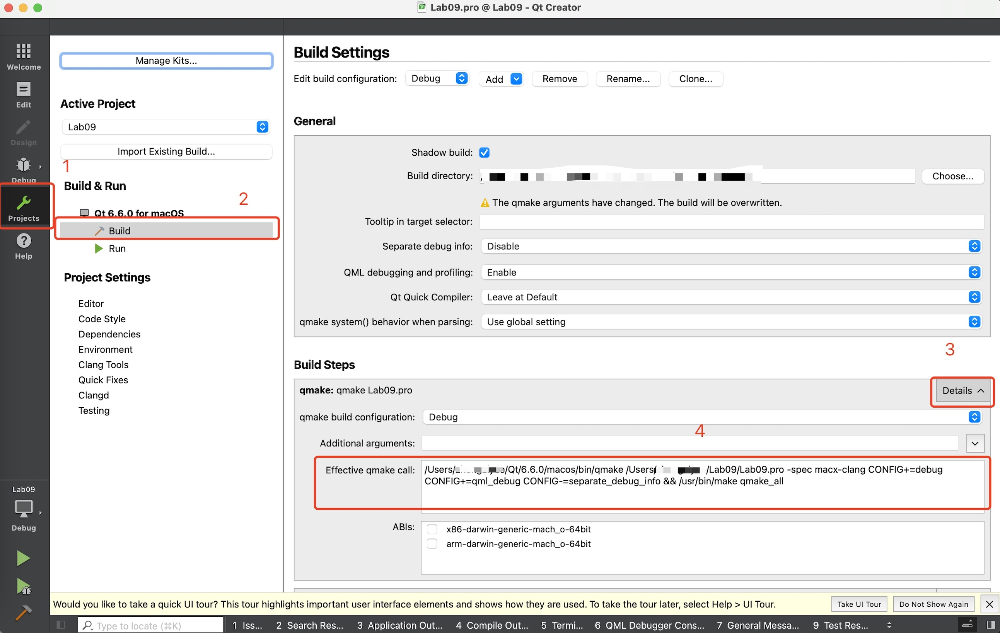

# Lab09 - GUI Programming: Basic Widget in qt
## Our Goal in Lab 09
1. Create a button. The button displays ○ before pressing and ● after pressing. 
2. Create a menubar with `Open` and `Save` choice in `File` items, `Copy` and `Paste` in `Edit` item.

## Please Sign You Up through Online Judge(OJ) System

## Step 0: Create a Qt application project
1. Open Qt Creator and create a new Qt Widgets Application.
2. Name your project `Lab09` and select the location to save it.
3. Click "Next" and choose the default options in the wizard.
4. Finish the project setup.

## Goal 1: Create a button.
### Step 1: Add your button in mainwindow.h
```cpp
#ifndef MAINWINDOW_H
#define MAINWINDOW_H

#include <QMainWindow>
#include <QPushButton>

class MainWindow : public QMainWindow {
    Q_OBJECT

public:
    MainWindow(QWidget *parent = nullptr);
    ~MainWindow();

private slots:
    void buttonPressed();

private:
    QPushButton *myButton;
};
#endif // MAINWINDOW_H

```

### Step 2: Create the button in mainwindow.cpp
```cpp
#include "mainwindow.h"
#include <QDebug>

MainWindow::MainWindow(QWidget *parent) : QMainWindow(parent) {
    myButton = new QPushButton("Unpressed", this);
    myButton->setGeometry(100, 100, 200, 50);
    connect(myButton, &QPushButton::clicked, this, &MainWindow::buttonPressed);

    setCentralWidget(myButton);
}

MainWindow::~MainWindow() {
    delete myButton;
}

void MainWindow::buttonPressed() {
    static bool pressed = false;
    if (pressed) {
        //TODO
        //myButton->setText("Unpressed");
        pressed = false;
    } else {
        //TODO:
        //myButton->setText("Pressed");
        pressed = true;
    }
}
```
### Step 3: Finish the requirements through you own implementation

Requirement: **The button displays ○ before pressing and ● after pressing.**

## Goal 2: Create a menubar with different items.

### Step 1: Add a QMenuBar to the main window
In your main window class (often named `MainWindow`), you'll need to include necessary headers and implement the QMenuBar.
Feel free to modify the code and try to implement functionalities that you want.

```cpp
// mainwindow.h

#ifndef MAINWINDOW_H
#define MAINWINDOW_H

#include <QMainWindow>
#include <QMenuBar>
#include <QMenu>

class MainWindow : public QMainWindow {
    Q_OBJECT

public:
    MainWindow(QWidget *parent = nullptr);

private:
    void createMenu();
};

#endif // MAINWINDOW_H

```
```cpp
// mainwindow.cpp

#include "mainwindow.h"

MainWindow::MainWindow(QWidget *parent) : QMainWindow(parent) {
    createMenu();
}

void MainWindow::createMenu() {
    QMenuBar *menuBar = new QMenuBar(this); // Create a menu bar

    // Create menus to be added to the menu bar
    QMenu *fileMenu = menuBar->addMenu("File");
    // TODO: Add Edit to menu bar

    // Add actions to the 'File' menu
    QAction *openAction = new QAction("Open", this);
    fileMenu->addAction(openAction);

    // TODO: Add Save item

    // TODO: Add actions to the 'Edit' menu

    // Set the menu bar for the main window
    setMenuBar(menuBar);
}

```
### Step 2: Build and run the application
Compile and run your application. You should see a window with a menu bar containing 'File' and 'Edit' menus. When clicking on 'File,' you should see 'Open' and 'Save' actions, and similarly for 'Edit' with 'Copy' and 'Paste' actions.


## Additional Content: How to compile the code through command line interface

### Use `qmake` to generate Makefile of Lab09

1. You may directly try command `qmake Lab09.pro` if you already configure the environment variable of `qmake`.
2. If no `qmake` environment, simply check the environment in your qt creator.
3. The command here should be `/Users/your-user-name/Qt/6.6.0/macos/bin/qmake Lab09.pro`



### Use `make` to generate the executable of Lab09

1. Simply `make` this project in this directory.

### A built Lab09 directory example in MacOS

```
├── Lab09.app
│   └── Contents
│       ├── Info.plist
│       ├── MacOS
│       │   └── Lab09
│       └── PkgInfo
├── Lab09.pro
├── Lab09.pro.user
├── Makefile
├── main.cpp
├── main.o
├── mainwindow.cpp
├── mainwindow.h
├── mainwindow.o
├── mainwindow.ui
├── moc_mainwindow.cpp
├── moc_mainwindow.o
└── ui_mainwindow.h
```
