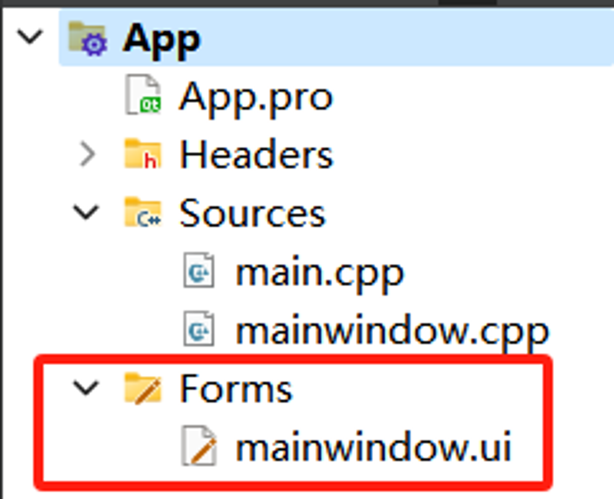
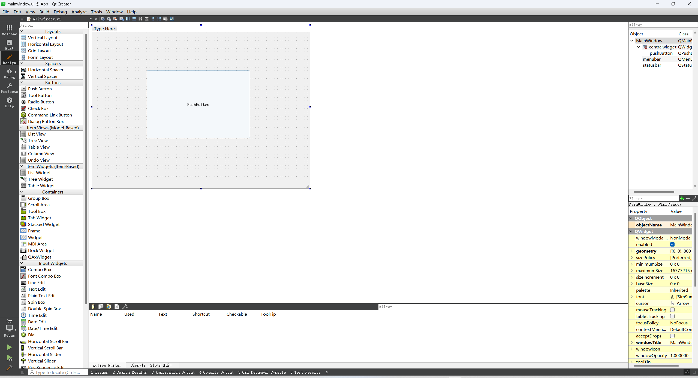

# Lab 10 - GUI Programming: Simple Text Editor
## Our Goal in Lab 10

1. Learn the usage of file stream in C++.
2. Learn to build a simple text editor using Qt.

## The Usage of File Stream

```cpp
#include <fstream>

using namespace std;

// Open an Input File Stream
ifstream in_stream("input.txt", ios::in);
// Open an Output File Stream
ofstream out_stream("output.txt", ios::out);

int main(){
	int a, b;
	in_stream >> a >> b;
	
	int c = a + b;
	out_stream << c << endl;	
	return 0;
}
```

## Task 1: Complete the problem on OJ

1. Complete the **problem 010L - Formatting** on the Online Judge.
2. You can utilize the functions from the standard library `<cctype>` to help with the ASCII character processing, such as `toupper()`, `tolower()`, `isalpha()`.
3. After finishing the problem, try to modify it into a file stream version and run it locally.

## File Input/Output in Qt

The file IO in Qt is very similar to what we have in C++, you can use the header `QTextStream` to get the related functions. But at the same time, Qt offers some GUI ways to edit files using the header `QTextEdit`.

You can add a `QTextEdit` to the window just like other components, it offers many useful functions:

```cpp
QTextEdit editor;
QString myString = "Hello, World"

// Set the text inside the text edit box
editor.setText(myString);
// Clear the text inside the text edit box
editor.clear();
// Get the plain text from the text edit box
QString contents = editor.toPlainText();
// Set the text color
textEdit->setTextColor(Qt::blue);
// ......
```

You can check the full list of APIs here: [QTextEdit Class | Qt Widgets 6.6.0](https://doc.qt.io/qt-6/qtextedit.html)

## Task 2: Use Qt to build a simple text editor

1. Get the code from the lab Github repository.
2. Open the Qt project with Qt Creator or VS Code.
3. Build and run the project.
4. Implement the function of saving files in the `mainwindow.cpp`.
5. Add a new menu to change the font, color, or other appearances of the editor.

## Thinking Time

- What is the difference between the directly declaring and the pointer declaring of a class, like what we have in the `MainWindow`?
- You may have noticed that many components in Qt share the same functions like `setGeometry()`, what are their origins, and are they equivalent?

## Additional Contents

### Visual GUI Designer in Qt Creator

When you create a new Qt Widgets Application, you will get something called **Forms** in your project template.



When you open the `mainwindow.ui` in your Qt Creator, you will see a new interface that allows you to drag new components directly into the window and set their attributes.



Using this method, you don’t need to add components by coding them into the main window class, they will be automatically added to the C++ code.

This UI is represented as a member in the `MainWindow` class, named as `ui` :

`mainwindow.h`:

```cpp
#ifndef MAINWINDOW_H
#define MAINWINDOW_H

#include <QMainWindow>

QT_BEGIN_NAMESPACE
namespace Ui { class MainWindow; }
QT_END_NAMESPACE

class MainWindow : public QMainWindow
{
    Q_OBJECT

public:
    MainWindow(QWidget *parent = nullptr);
    ~MainWindow();

private:
    Ui::MainWindow *ui; // Here is the ui, it is declared as a pointer
};
#endif // MAINWINDOW_H
```

`mainwindow.cpp`:

```cpp
#include "mainwindow.h"
#include "ui_mainwindow.h"

MainWindow::MainWindow(QWidget *parent)
    : QMainWindow(parent)
    , ui(new Ui::MainWindow)
{
    ui->setupUi(this); // Here is the constructor to setup the ui
}

MainWindow::~MainWindow()
{
    delete ui;
}
```

As you can see, we have another header in the file, which is `ui_mainwindow.h`. You can try to open it and see the contents (ctrl+left-click), and you will find that this header is generated from the UI you just designed.